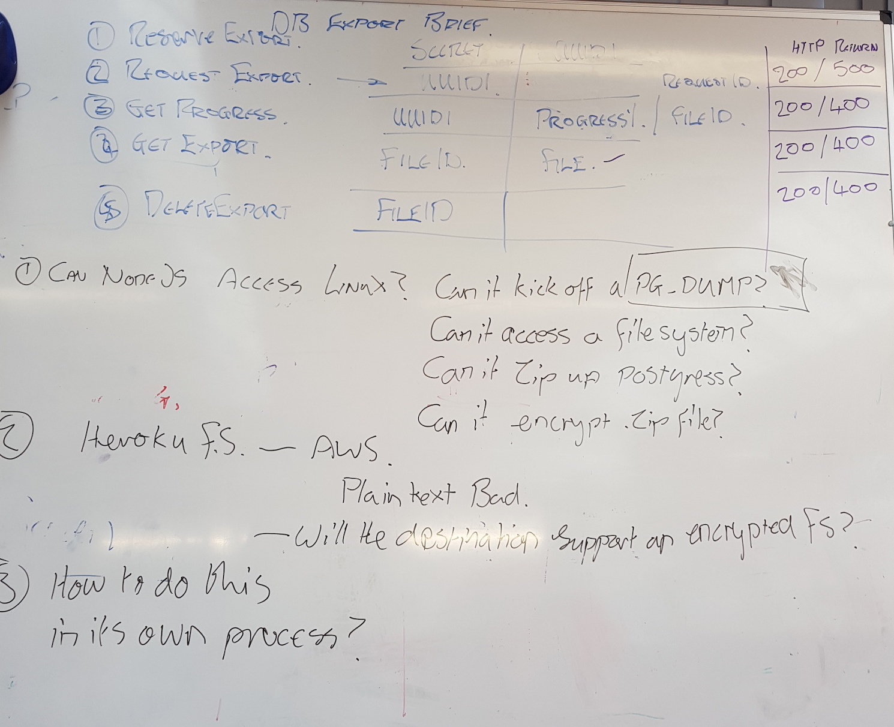

# Appatella Research API

# Brief
The Appatella Research API in it's first instance will be able to export a copy the database for analysis. However, before that can happen, all instances of each course id must be replaced with a new uuid.
Once the database copy for exportation has been anonymised, it will be encrypted with a given secret. The user will then be able to download the encrypted and anonymised DB.

## API specification
| Request         | Parameters      | Response      | Statuses      | Description   |
|:----------------|:----------------|:--------------|:--------------|:--------------|
|Reserve Export   | secret          |exportRequestId| 200/500       |Used to make preparations for a export reservation to be made. The returned uuid should be noted as it is required in requesting an export.|
|Request Export   | exportRequestId |               | 200/400       |Used to kick off the exporting process, which may take a moment.|
|Get Progress| exportRequestId         | progress% / fileId  | 200/400 |Used to return how far the exportation has gotten, if complete: returns fileId|
|Get Export       | fileId          | file          | 200/400       |Used to download the file|
|Delete Export    | fileId          |               | 200/400       |Used to delete the exported file copies on the server|
|Post Export       | file, secret            |               | 200/500       |Requires an export file and the encryption secret. will decrypt and unpack the exported file and push into the database, only if it's empty. |

## How will the database be exported?

## How will the database be anonymised?

## How will the database be ?

